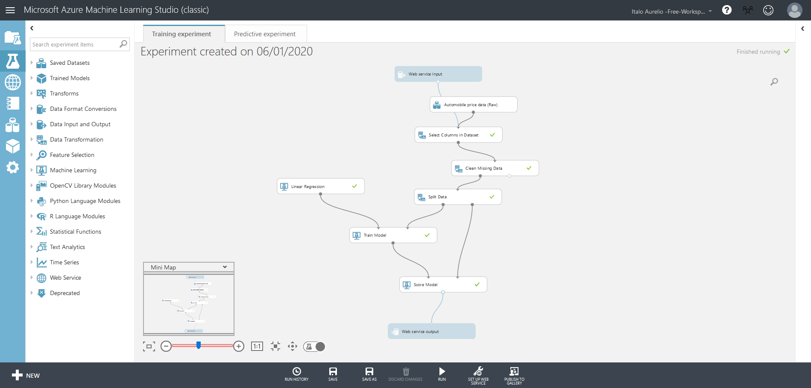
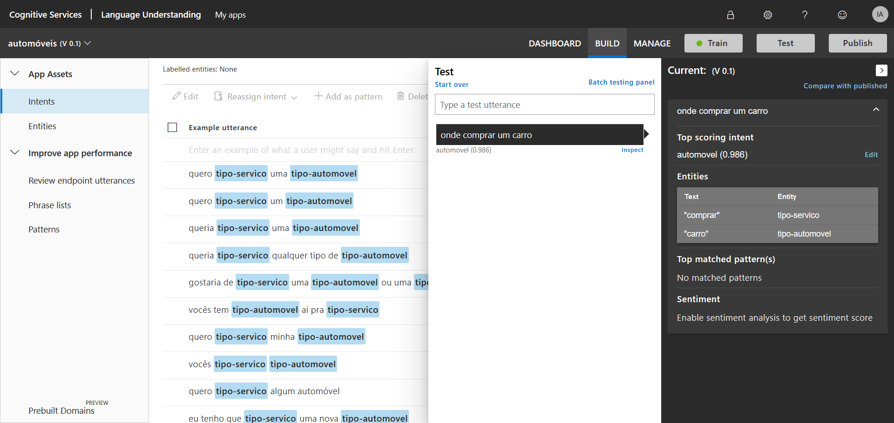

# Academia IA Microsoft - Introdução IA

Acesse o material [aqui](https://www.microsoft.com/pt-br/academia)

A Inteligência Artificial (IA) é uma forma de ampliar a capacidade humana e permitir que possamos nos concentrar em atividades como criatividade, empatia e inventividade de nossa mente para que possamos trabalhar em um mercado futuro mais centrado.

Machine Learning é um subconjunto de IA que permite um sistema aprender através de dados, ao invés de aprender via programação explícita. No inicio do processo é feita uma Modelagem que consiste em obter os dados, trabalhar com eles e entender como esses dados funcionam, em alguns momentos são necessários alguns filtros e reestruturação para ter uma base sólida. São esses dados quem irão modelar o funcionamento de sua IA, cuide bem deles.

O algoritmo de machine learning irá analisar os dados, encontrar um padrão e retornar a resposta à sua pergunta.

Inicialmente os tipos de aprendizados são os seguintes:

### Supervisionado
No aprendizado supervisionado o ML recebe uma previsão do que ele precisa retornar.
- Regression:
  Qual seria o valor? Qual seria a nota?
- Classification:
  Qual classe isso pertence?
### Não supervisionada
No aprendizado não supervisionado o ML analisa os dado e define o que ele precisa retornar como resultado.
- Clustering:
  Existem grupos distintos? Qual grupo pertence?
- Anomaly Detection:
  Esse comportamento é estranho?
- Recomendation:
  Qual opção devo escolher?

Experimento criado para prever o preço de um veículo:

Foi fornecido uma base de dados padrão para o aprendizado da Azure, com esses dados selecionei as colunas de interesse para treinar, os campos de preço que são importantes que estivessem vazios foram excluidos do treinamento para não influenciar o resultado. Com os dados tratados o treino foi feito utilizado o algoritmo de regressão linear e gerou um resultado final com 0.89 de acertividade. Ao final foi inserida um input e output para consulta web.

## Serviços Cognitivos
Utilização de IA para realização e identificação de tarefas cognitivas como visão, fala, idioma, conhecimento, busca e diversos outros modelos de cognição.

Formas de analisar os dados que foram inseridos dentro do site com base em diversos fatores como sentimentos, frases, imagens, idiomas.

### Criação utilizando Luis AI
A intenção é identificar o interesse do usuário se ele deseja alugar/comprar um carro com base no que foi digitado.
- Ensinar o "Luis" sobre o contexto do serviço de alugar um carro, para que ele possa "entender" como tratar cada informação.
- Separar entidades importantes para que possa ser analisado e considerado como definidores da frase.

Caso já possua uma base de dados para alimentar o bot é excelente, faça uma curadoria desses dados e forneça como input, com isso o treinamento fica muito mais eficiente.

### Visão Computacional
Responsável por identificar imagens e cenas dentro de foto ou vídeos e extrair informações desse contexto.
